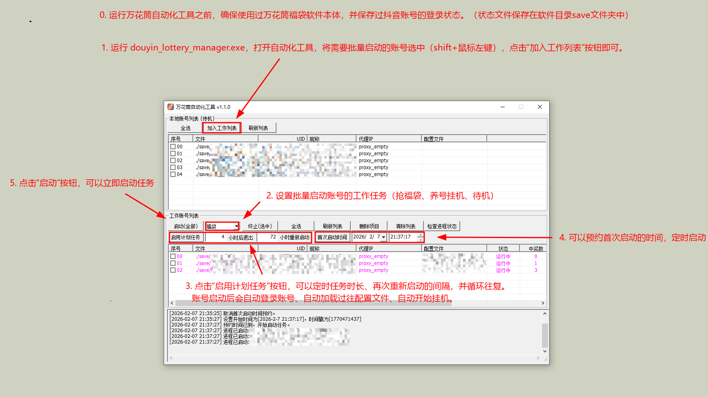

# 抖音福袋万花筒 v10.6.0

[2026-2-25] 抖音福袋万花筒，抖音抢福袋工具，抖音无水印视频下载器，抖音直播间录制下载器。

TG通知群：

	https://t.me/+_3rhEtjaQElhMTgx 

QQ群：

  	https://www.linkdd.cn/whtvip

关于免费版：
	
  免费版暂停发布了，以后也不会发布了。不是我不想发布，是真的没办法了，感谢理解。
  因暂停了7日，vip统一双倍补偿，共顺延补偿14天。

## v10.6.0

	优化了自动化功能，解决了在特定情况下，账号批量启动加载配置后卡住的问题。
	
--------------------------------------------------------------------------------

## v10.5.0

	优化了自动化功能，增加了待机模式启动、养号模式启动、抢福袋模式启动3个模式。
		待机模式启动后，加载账号数据和配置后，什么都不会做，等待用户手动处理。
		养号模式启动后，加载账号数据和配置后，自动进入养号模式。
		抢福袋模式启动后，加载账号数据和配置后，自动扫描直播间并抢福袋。
	
	在万花筒自动化工具中，现在可以预约首次启动时间了。

		该功能主要为了解决部分工作室用户的需求：
		比如工作室1台电脑有20个抖音账号，每5个账号一批次，共分4批次错开时间执行，滚动抢福袋，直至完成20个账号的抢福袋任务。

		具体操作流程：
		第一批次的1-5账号挂机两个小时后关闭，72小时后重启任务。第二批次6-10账号在第一批次账号退出随后自动开启继续挂机抢福袋，挂机两小时后退出，依次类推，直至20个账号全部滚动完成。

		该流程目前可以用万花筒自动化工具实现了：
		需要打开4个万花筒自动化工具，分别将4个批次的账号加入到各个自动化工具的工作列表中，设置好预约首次启动时间，将4个批次的账号工作时间完美错开即可。（自动化工具的内存使用空间极小，可以忽略不记，如果账号量较大，开20个也占用不了多少资源）

		在计划任务中“重新启动”间隔的时间，是以每个账号启动的时间开始计算的，账号与账号之间相互不干涉。

	

# 合作代理
		招收合作代理，请有网络推广和营销经验的朋友，加我的合作伙伴详谈
		要求：
		1.有丰富的网络推广和营销经验，有线下工作室推广经验更好。(可免费定制广告位)
		2.TELEGRAM每日在线
		3.熟练使用交易所usdt。
		有意者请联系 TG: @dyndj888

# 功能如下：

      1.扫描全网福袋池。
    
      2.支持蹲点抢固定直播间福袋。
    
      3.支持加入粉丝团功能，用户可以抢粉丝团专属福袋。
    
      4.支持自动停止抢福袋的功能，可以按需设置停止条件，满足设定的最大抢福袋数量或运行时长后会立即停止。
    
      5.支持在抢福袋的同时，将直播间中的红包一并抢掉。
    
      6.支持检测官方滑块验证码，并将警告信息推送到用户手机微信上。
    
      7.支持只抢大福袋、优先抢大福袋的功能。
    
      8.支持代理ip配置，方便工作室账号批量配置。

	  9.支持只抢关注主播列表福袋。
	  
	 10.支持软件批量自动化，自动打开软件，自动设置账号，自动加载配置，定时自动开工，自动退出。

# 使用说明：

      1.打开douyin_lottery软件目录，运行douyin_lottery.exe即可。
      
      2.直播间抢福袋功能，支持扫描平台所有直播间，并过滤出正在发放福袋的直播间进行参与。
      
      3.抢福袋可指定固定直播间，蹲点抢福袋功能，可以预先设置指定的直播间进行蹲点抢福袋（在软件右上角关注的直播间中，选择“监控此直播间”，点击“挂机抢固定福袋”按钮）。
      
      4.支持查看中奖纪录，包括中奖时间，直播间地址，中奖物品的名称和中奖数量。
      
      5.如果福袋中奖率过高，账号可能会被官方风控，一段时间内不会再中福袋（一般休息2天）。等一段时间再试试即可。
      
      6.支持推送信息到手机微信。包括中奖信息推送、中奖实物信息推送、验证码弹出警报推送，可以在手机上实时看到推送信息。
      
        设置方法：
      
        https://www.pushplus.plus/
        注册并拿到用户token，复制下来。
        打开软件目录中的push.txt文件，将用户token粘贴保存。一行一个token，消息产生后会循环推送。例如设置5行5个用户token，推送会发送给5个不同的手机微信上。
        免费的plus用户支持每天200条推送。微信服务号如果接收推送没有声音和消息提示，建议在服务号中选择“plusplus推送加”设置一下消息免打扰为否即可。
      
      7.支持屏蔽福袋名称的功能，有用户反应经常中奖一些垃圾实物福袋，现在可以根据福袋关键词触发屏蔽了
	      设置方法：
        打开软件目录下的“banlist.txt”文件，编辑关键字，一行一个。比如屏蔽内容为“书”、“照”。当福袋内容为“养生书”或“XXX签名照”时，会直接触发屏蔽并跳过该直播间。
        
        8.直播间录制的MP4视频，有时候会出现进度条异常或黑屏的情况，可能是由于网络波动导致的视频文件不完整。使用MP4视频修复软件修复一下即可。
        
        9.支持http/https代理。在软件目录中配置proxy.txt即可。一行一个，格式为ip:port@user#password，无用户密码的代理可以留空，如8.8.8.8:8888@#

        10.支持批量设置软件启动时间和关闭时间，自动设置账号，自动加载账号配置，自动开工，自动退出，适合工作室用户使用。该功能需要主控端配合使用，确保软件目录下save目录中，已存在保存的账号数据文件，打开软件目录下douyin_loterry_manager.exe使用即可。
		

注意：如果遇到打不开软件或解压出现问题的情况，可能需要在使用本软件时临时关闭杀毒软件或Windows Defender。

关闭方式如下：

https://www.cnblogs.com/emanlee/p/17406620.html

如果还不能正常运行，可能是运行环境损坏或不全导致的，下载运行时环境，解压并覆盖到软件目录即可：

http://www.app-bos.com/iKhph321j8ba
